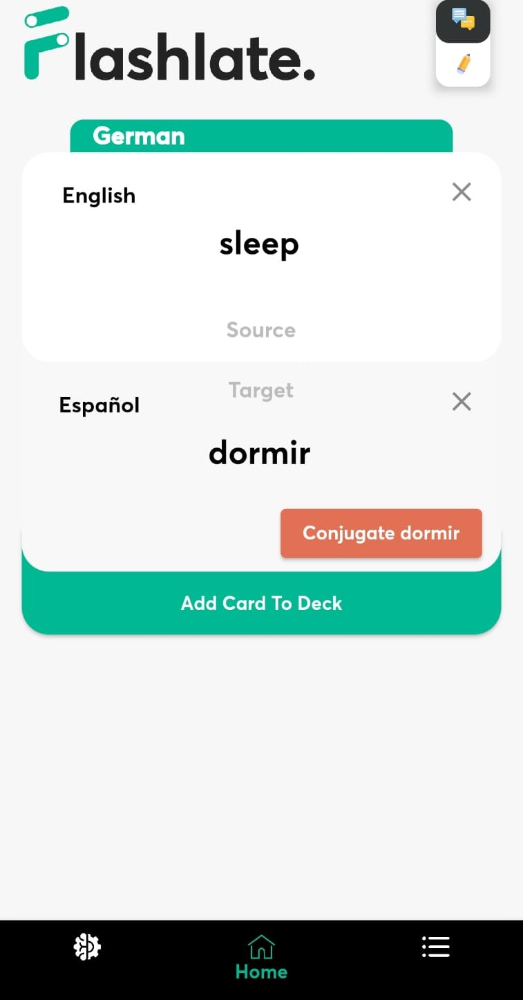
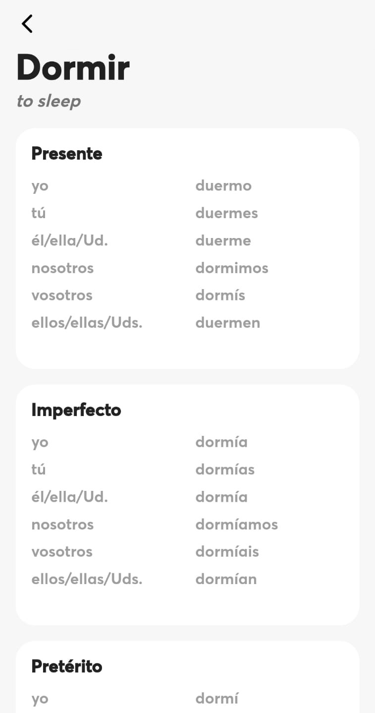
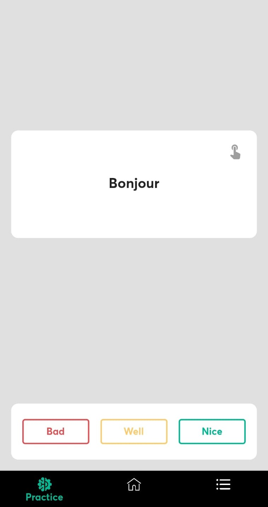
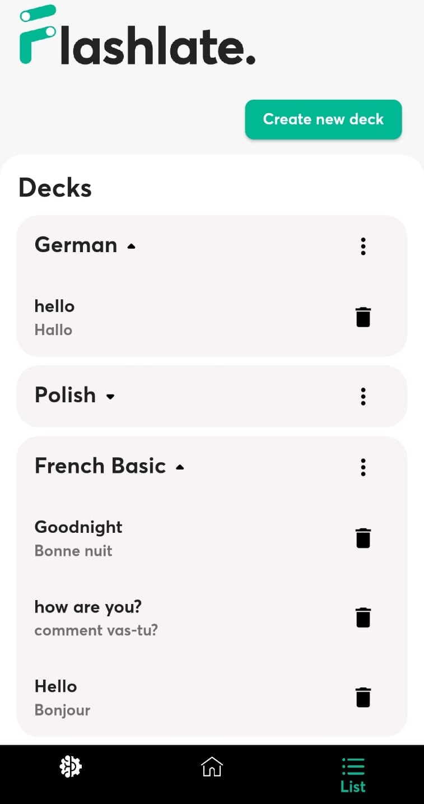

# flashlate

Flashcard app with integrated translate function



## My Idea:

Creating a translate Application that combines translations, flashcards, overviews and konjugations.

**All in one App**

## The Main Page




The user can directly conjugate verbs inside the app!

## The Practice Page



The user can train his memory skills and use one of the best memorization techniques to learn a new language.

## The List Page



The user gets an overview over all his practice decks. 

Here can decks be added and removed.


### Github Collaboration
#### First Steps

- Fork the repo
- Clone the repo locally:
    - ``` git clone git@github.com:philipprobin/flashlate.git ```
- Create your own feature branch for feature dev:
    - ``` git checkout -b own_branch_name ```
- Add the upstream branch from the original repo:
    - ``` git remote add upstream git@github.com:philipprobin/flashlate.git```

### The Usual Workflow anytime you want to commit

- Checkout to your branch and add features:
    - ``` git checkout own_branch_name ```
- Update your current fork to stay in sync with the original upstream, **Very Important!!**:
    - ``` git pull -r upstream main```
- Commit your changes:
    - ``` git status ```
    - ``` git add . ```
    - ``` git commit -m 'message' ```


### Push to the main repo

- Push your changes to the main repo:
    - ``` git push --set-upstream origin own_branch_name ```
- Open Pull Request
- The Owner merges the pull request.

## You are done!
